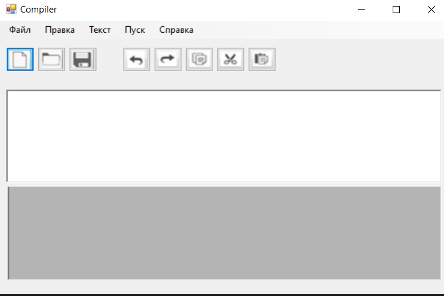
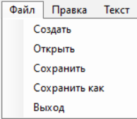
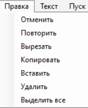
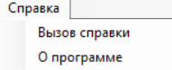

## Compiler

  

Это простое приложение на C#, представляющее собой текстовый редактор с базовыми функциональностями. Позволяет открывать, редактировать и сохранять текстовые файлы.

## Contents
1. [Основные функции](#основные-функции) 
   
   1.1 [Файл](#файл)
   
   1.2 [Правка](#правка)
   
   1.3 [Справка](#справка)
   
2. [Инструкции по установке](#инструкции-по-установке)
3. [Примечание](#примечание)

 

 

## Основные функции

Файловое меню:

* Создание нового файла

* Открыть (Open): Позволяет выбрать и открыть существующий текстовый файл.

* Сохранить (Save): Сохраняет текущий текст в ранее выбранный файл или предоставляет возможность выбора нового файла.

* Сохранить как (Save As): Позволяет выбрать новое место и имя для сохранения файла.

* Выход (Exit): Завершает работу приложения.

Редактирование текста:

* Вырезать (Cut): Вырезает выделенный текст и помещает его в буфер обмена.

* Копировать (Copy): Копирует выделенный текст в буфер обмена.

* Вставить (Paste): Вставляет текст из буфера обмена в текущую позицию курсора.

* Удалить (Delete): Удаляет выделенный текст.

* Выделить все (Select All): Выделяет весь текст в редакторе.

* Отмена и Повтор (Undo/Redo)

* Отмена: Отменяет последнее действие.

* Повтор: Возвращает отмененное действие.

Помощь и О программе:

* Помощь: Открывает окно справки.
* О программе: Открывает окно с информацией о программе.

## Инструкции по установке

* 1)Склонируйте репозиторий или загрузите архив с исходным кодом.
  
  Откройте проект в вашей среде разработки (например, Visual Studio).
  
  Соберите и запустите проект.

* 2)Откройте готовое решение (SLN)

## Примечание

При закрытии приложения с несохраненными изменениями, будет предложено сохранить изменения.

Все файлы сохраняются в формате текстовых файлов (.txt).

Автор

[Артем Найманов]

Приятного использования! <3
