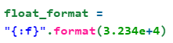
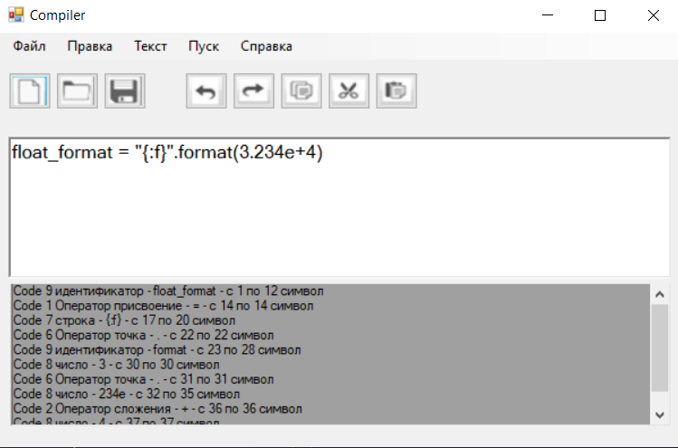
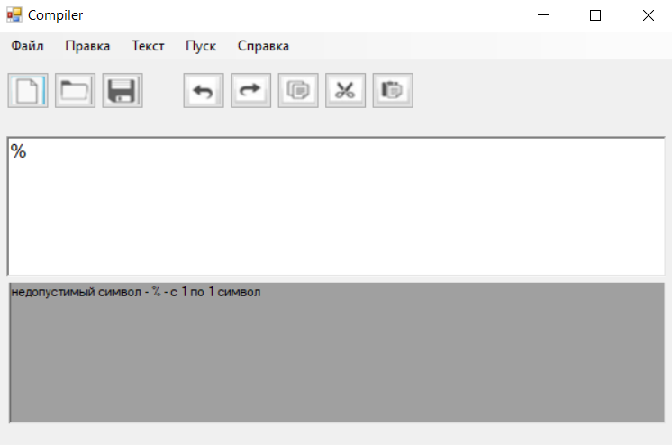
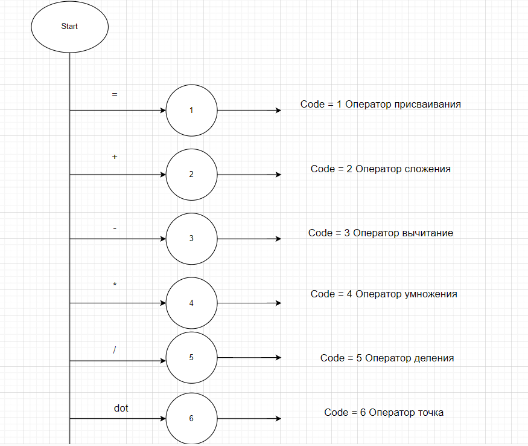
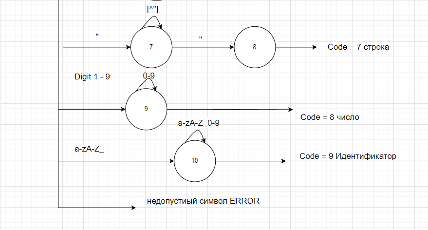

## Compiler 2 lab

Лабараторная работа 2

## Contents
1. [Описание](#описание)  
2. [Примеры допустимых строк и не допустимиых строк](#примеры-допустимых-строк-и-не-допустимиых-строк)
3. [Диаграмма состояний сканера и тестовые примеры](#диаграмма-состояний-сканера-и-тестовые-примеры)

## Описание

Задача:
Цель работы: Изучить назначение лексического анализатора. Спроектировать алгоритм и выполнить программную реализацию сканера.

В соответствии с вариантом задания необходимо:

Спроектировать диаграмму состояний сканера (примеры диаграмм представлены в прикрепленных файлах).
Разработать лексический анализатор, позволяющий выделить в тексте лексемы, иные символы считать недопустимыми (выводить ошибку).
Встроить сканер в ранее разработанный интерфейс текстового редактора. Учесть, что текст для разбора может состоять из множества строк.
Входные данные - строка (текст программного кода).

Выходные данные - последовательность условных кодов, описывающих структуру разбираемого текста с указанием места положения и типа ("число", "идентификатор", "знак", "недопустимый символ" и т.д.). Например, для строки "int x=123;":
14 - ключевое слово - int - с 1 по 3 символ
11 - разделитель - (пробел) - с 4 по 4 символ
2 - идентификатор - x - с 5 по 5 символ
10 - оператор присваивания - = - с 6 по 6 символ
1 - целое без знака - 123 - с 7 по 9 символ
16 - конец оператора - ; - с 10 по 10 символ

Персональный вариант
Разработать лексический анализатор для Python пример кода:

## Примеры допустимых строк и не допустимиых строк

## Диаграмма состояний сканера и тестовые примеры

Автор

[Артем Найманов]

Приятного использования! <3
